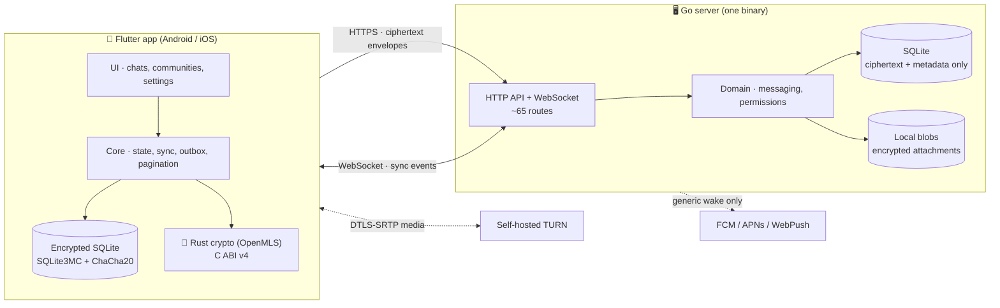
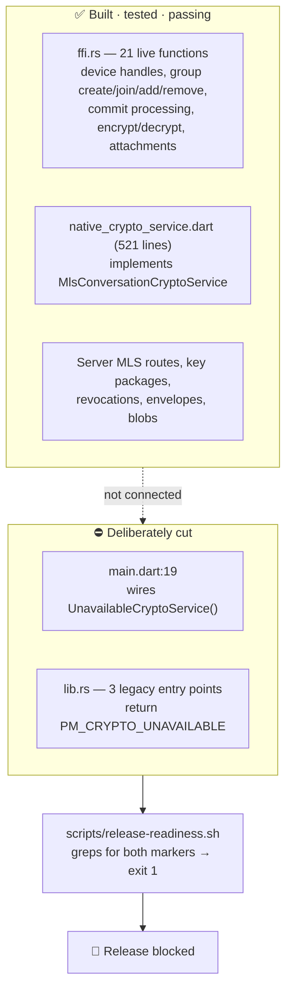
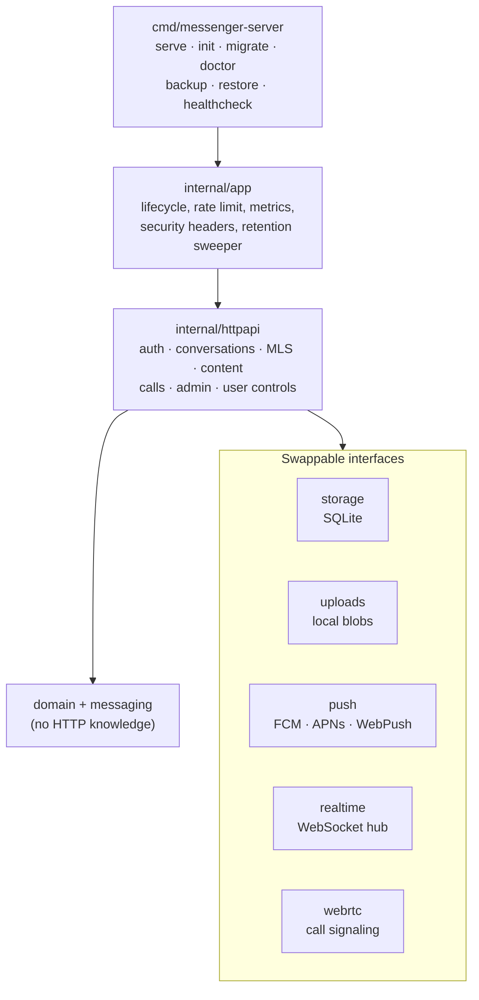
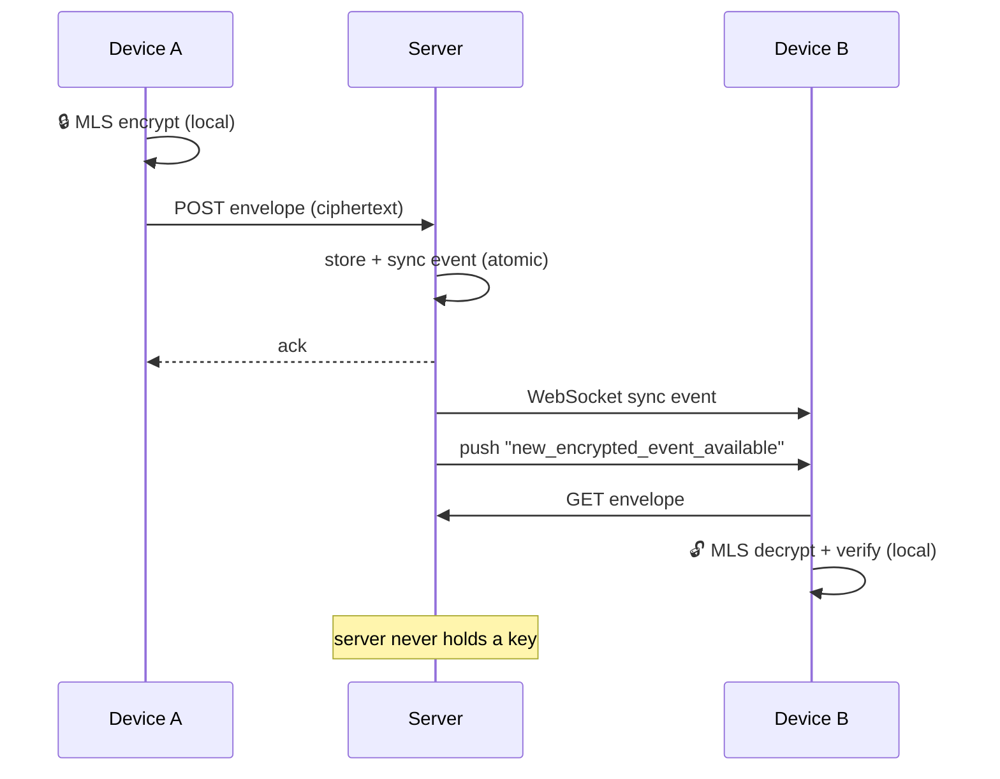
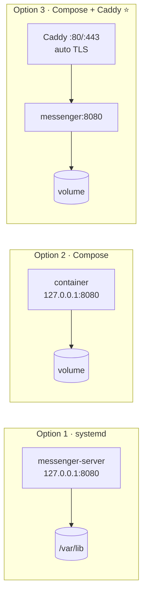
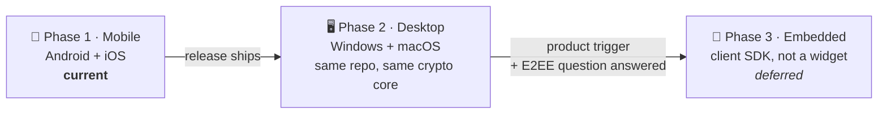

# Veritra — Project Overview

Self-hosted, privacy-first messenger. AGPL-3.0-or-later.
Go server · Flutter app · Rust/OpenMLS crypto.

Orientation for someone new to the repository: what it is, how it is put
together, and how to run it. **Current work and status live in
[`board.md`](board.md)**, not here.

**Snapshot:** server behaviour below verified at commit `6c22e44` on 2026-08-05.

---

## 1. Does it start by itself?

**Yes.** Built and run from a clean checkout — no config, no setup.

```sh
cd server && go run ./cmd/messenger-server serve
```

| Check | Result |
| --- | --- |
| Build (Go 1.25.12 auto-fetched) | ✅ clean |
| Start with zero config | ✅ `server_starting addr=:8080` |
| 23 migrations applied on boot | ✅ automatic |
| `GET /healthz` | ✅ `200` `{"status":"ok"}` |
| `GET /api/v1/setup/status` | ✅ `{"instance_name":"Veritra","setup_required":true}` |
| `GET /setup` | ✅ page renders |
| `doctor` | ✅ `storage: ok` |
| Data dir created | ✅ `db` + `blobs/` + writer lock |

**Caveat:** it starts and serves, but you **cannot finish setup or send a message** — see §3.

Safety gates also verified to fire correctly:

| Scenario | Behaviour |
| --- | --- |
| `ENV=production`, fresh DB, no setup token | ⛔ refuses to start |
| `ENV=production`, `0.0.0.0`, no trusted proxies | ⛔ refuses to start |
| Second process on same data dir | ⛔ refuses (`.veritra-server.lock`) |

---

## 2. Architecture



**The rule that shapes everything:** the server never sees plaintext. It stores
ciphertext, routes it, and knows metadata (who, when, how big). No server-side
content search, no telemetry, no admin plaintext access.

---

## 3. ⚠️ The one thing to understand: the crypto gate

Production crypto is **built and tested, then deliberately unplugged.**



Both halves were confirmed at this snapshot: the Rust suite passes **17/17**,
including `ffi_group_lifecycle_exchanges_and_revokes_messages` — a full
two-device MLS exchange through the C ABI. And `release-readiness.sh` correctly
reports `release blocked: production MLS crypto is not wired`.

**What this means in the app:**

| Works today | Blocked by the gate |
| --- | --- |
| Browse, navigate, connect UI | Sending / reading any message |
| Named DMs, groups, rosters | Owner setup (needs a real device key) |
| Block, mute, leave, remove | Reply, edit, delete, reactions |
| Pagination, search metadata | Attachments (pick, upload, preview) |
| Device list, invites, settings | Safety-number display |

---

## 4. Code map

| Area | Path | Size | Status |
| --- | --- | --- | --- |
| Go server | `server/` | 15.3k LOC | ✅ complete, tests pass |
| Flutter app | `mobile/lib/` | 14.0k LOC | 🟡 complete except crypto-gated UI |
| Rust crypto | `crypto/rust/` | 2.3k LOC | 🟡 complete, ABI not wired |
| Migrations | `server/migrations/` | 23 files | ✅ |
| Deploy | `deploy/` | Compose · Caddy · systemd | ✅ |
| Design | [`design.md`](design.md) | palette + per-screen spec | 🟡 K2 · Bone, landing as I28 |
| Branding | [`branding/`](branding/) | marks, wordmarks, icons | ✅ |
| Board | [`board.md`](board.md) | — | single source of truth |

### Server modules



### Message send path



---

## 5. Hosting options



| Option | Command | TLS | Best for |
| --- | --- | --- | --- |
| **Binary + systemd** | `deploy/systemd/` | your own proxy | bare metal / VPS |
| **Docker Compose** | `docker compose up` | your own proxy | existing proxy setup |
| **Compose + Caddy** ⭐ | `docker compose --profile caddy up` | automatic Let's Encrypt | most self-hosters |
| **Container image** | `ghcr.io/servesyourice/veritra` | — | published on `v*` tag |

**Hardening already in place:** scratch base image (no shell), non-root UID
65532, `no-new-privileges`, memory/PID limits, loopback-only HTTP binding,
single-writer lock, `/readyz` drain on shutdown.

**Supported design:** exactly one node, SQLite, local blobs.
**Out of scope:** PostgreSQL, S3, NATS, federation, multi-node.

**Optional add-ons** (all off by default): FCM · APNs · WebPush · self-hosted
TURN for calls · Prometheus metrics on a private `:9090`.

---

## 6. Status and roadmap

**Status lives in one place: [`board.md`](board.md).** Card state, release
evidence, verification runs and the independent-review brief are all there. This
document deliberately does not repeat them — the duplicate copy is what went
stale last time. In shape: most cards are done, one is active and unblocked, and
the rest wait on people, hardware or upstream.

### Sequencing (decision D06)



Mobile is the entire first release. Desktop follows as **additional Flutter
targets in this repository**, reusing the reviewed Rust core — not a fork, which
would owe a separate independent security review for a second copy of the same
protocol. Embedding is deferred until someone answers whether embedded
conversations stay end-to-end encrypted; if they do, the deliverable is a client
SDK, because there is no server-side key to hand a drop-in widget. Full triggers
are in the board's roadmap section.

A self-hosted internal-network deployment is Phase 2 plus this same server. It
needs no server change.

---

## 7. Verification

The last full recorded run, its date and its results are in the board's release
evidence matrix. Reproduce with the commands in §8 — they fall back to pinned
Docker images when a toolchain is missing, so the checks are runnable anywhere
Docker is.

Two results are worth knowing before you run them: `release-readiness.sh` is
**expected to fail** at the intentional crypto gate, and `cargo-audit` is
**conditional** on the time-bounded I27 exceptions.

---

## 8. Commands

```sh
./scripts/test.sh       # Go + Rust + Flutter (Docker fallback if no toolchain)
./scripts/lint.sh       # formatters + linters
./scripts/dev.sh        # local dev server
```

```sh
# server subcommands
messenger-server serve | init | migrate | doctor | healthcheck
messenger-server backup <dir> | restore <dir>
messenger-server reset-owner-password --account <u> --password-file <f>
```

---

## 9. Bottom line

| | |
| --- | --- |
| **Does it start?** | ✅ Yes — clean, zero config, self-migrating |
| **Is it usable?** | ❌ No — messaging is intentionally fail-closed |
| **Is the code done?** | ✅ Essentially — see [`board.md`](board.md) for the count |
| **What's left?** | one local card; the rest need people, hardware or upstream |

The engineering is done and it holds together. What remains is a visual rebuild
to finish, an upstream dependency, some hardware, and a reviewer.
