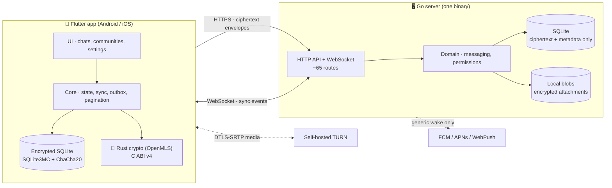
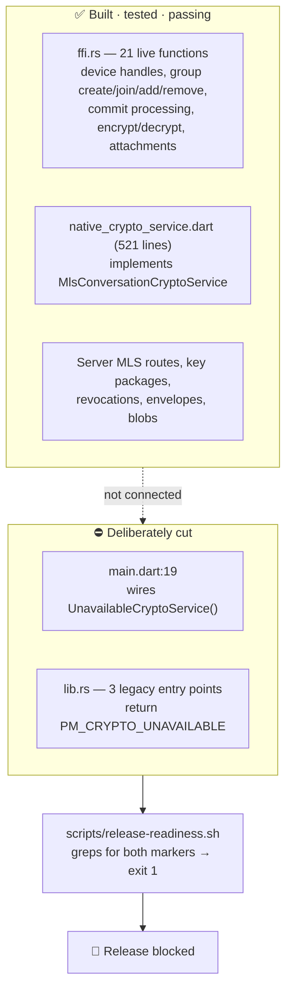
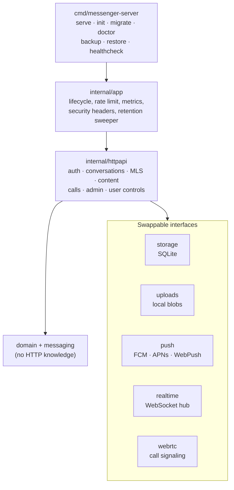
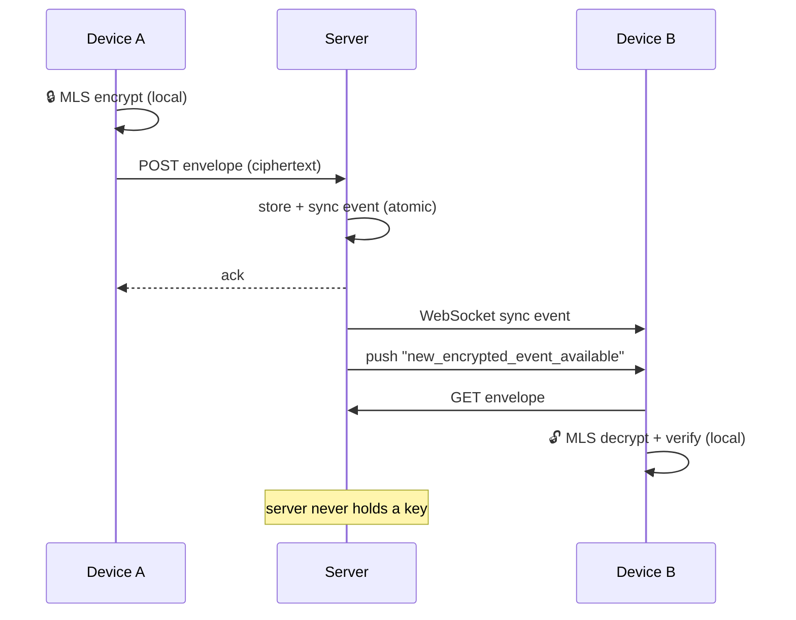
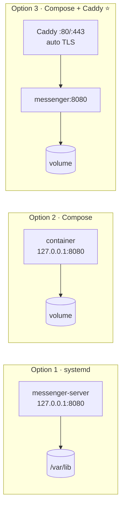
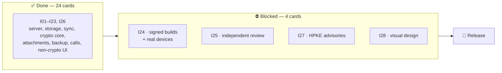

# Veritra — Project Overview

Self-hosted, privacy-first messenger. AGPL-3.0-or-later.
Go server · Flutter app · Rust/OpenMLS crypto.

**Snapshot:** commit `6c22e44` · verified 2026-08-05

---

## 1. Does it start by itself?

**Yes.** Built and ran it today from a clean checkout — no config, no setup.

```sh
cd server && go run ./cmd/messenger-server serve
```

| Check | Result |
| --- | --- |
| Build (Go 1.25.12 auto-fetched) | ✅ clean |
| Start with zero config | ✅ `server_starting addr=:8080` |
| 23 migrations applied on boot | ✅ automatic |
| `GET /healthz` | ✅ `200` `{"status":"ok"}` |
| `GET /api/v1/setup/status` | ✅ `{"instance_name":"Veritra","setup_required":true}` |
| `GET /setup` | ✅ page renders |
| `doctor` | ✅ `storage: ok` |
| Data dir created | ✅ `db` + `blobs/` + writer lock |

**Caveat:** it starts and serves, but you **cannot finish setup or send a message** — see §3.

Safety gates also verified to fire correctly:

| Scenario | Behaviour |
| --- | --- |
| `ENV=production`, fresh DB, no setup token | ⛔ refuses to start |
| `ENV=production`, `0.0.0.0`, no trusted proxies | ⛔ refuses to start |
| Second process on same data dir | ⛔ refuses (`.veritra-server.lock`) |

---

## 2. Architecture



**The rule that shapes everything:** the server never sees plaintext. It stores
ciphertext, routes it, and knows metadata (who, when, how big). No server-side
content search, no telemetry, no admin plaintext access.

---

## 3. ⚠️ The one thing to understand: the crypto gate

Production crypto is **built and tested, then deliberately unplugged.**



Both halves confirmed today: Rust suite passes **17/17**, including
`ffi_group_lifecycle_exchanges_and_revokes_messages` — a full two-device MLS
exchange through the C ABI. And `release-readiness.sh` correctly reports
`release blocked: production MLS crypto is not wired`.

**What this means in the app:**

| Works today | Blocked by the gate |
| --- | --- |
| Browse, navigate, connect UI | Sending / reading any message |
| Named DMs, groups, rosters | Owner setup (needs a real device key) |
| Block, mute, leave, remove | Reply, edit, delete, reactions |
| Pagination, search metadata | Attachments (pick, upload, preview) |
| Device list, invites, settings | Safety-number display |

---

## 4. Code map

| Area | Path | Size | Status |
| --- | --- | --- | --- |
| Go server | `server/` | 15.3k LOC | ✅ complete, tests pass |
| Flutter app | `mobile/lib/` | 14.0k LOC | 🟡 complete except crypto-gated UI |
| Rust crypto | `crypto/rust/` | 2.3k LOC | 🟡 complete, ABI not wired |
| Migrations | `server/migrations/` | 23 files | ✅ |
| Deploy | `deploy/` | Compose · Caddy · systemd | ✅ |
| Design | `design/` | 4 proposals | ⬜ nothing wired, awaiting pick |
| Board | `implementation/KANBAN.md` | — | single source of truth |

### Server modules



### Message send path



---

## 5. Hosting options



| Option | Command | TLS | Best for |
| --- | --- | --- | --- |
| **Binary + systemd** | `deploy/systemd/` | your own proxy | bare metal / VPS |
| **Docker Compose** | `docker compose up` | your own proxy | existing proxy setup |
| **Compose + Caddy** ⭐ | `docker compose --profile caddy up` | automatic Let's Encrypt | most self-hosters |
| **Container image** | `ghcr.io/servesyourice/veritra` | — | published on `v*` tag |

**Hardening already in place:** scratch base image (no shell), non-root UID
65532, `no-new-privileges`, memory/PID limits, loopback-only HTTP binding,
single-writer lock, `/readyz` drain on shutdown.

**Supported design:** exactly one node, SQLite, local blobs.
**Out of scope:** PostgreSQL, S3, NATS, federation, multi-node.

**Optional add-ons** (all off by default): FCM · APNs · WebPush · self-hosted
TURN for calls · Prometheus metrics on a private `:9090`.

---

## 6. Status board



### The 4 blockers

| # | What | Blocked on | Can you unblock it? |
| --- | --- | --- | --- |
| **I28** | Pick a visual direction | **Your decision** | ✅ **Yes — today, alone** |
| **I27** | 6 HPKE/libcrux advisories | Upstream OpenMLS release | ❌ wait for upstream |
| **I24** | Signed builds + device matrix<br/>*(code is done — push, TURN, WebRTC all shipped)* | Signing keys, 2 phones, a Mac, TURN host, push creds | 🟡 partly — needs hardware |
| **I25** | Independent security review | An external reviewer (**not assigned**) | 🟡 you can hire one |

> ⏰ **I27 re-review is due 2026-08-29** — 24 days out. The advisory exceptions
> in `scripts/audit-rust.sh` are time-bounded and expire then.

### I28 in one paragraph

The app is stock Material 3 with the defaults left on — one teal seed, no
`TextTheme`, no fonts, stock Flutter launcher icons. `design/` holds four
proposed directions rendered side by side in **`design/preview.html`** (open it
in a browser). Recommendation there is **Direction A · Ink**, because it already
matches the branding in `docs/branding/concept-06/`. Nothing is wired in — it
needs one decision, then the work is mechanical.

---

## 7. Verified today (2026-08-05)

| Check | Result |
| --- | --- |
| `go build` | ✅ clean |
| `go test ./...` | ✅ all packages pass |
| `cargo test` | ✅ 17/17 |
| Server cold start + endpoints | ✅ see §1 |
| Production startup gates | ✅ fail closed correctly |
| `doctor` | ✅ storage ok |
| `release-readiness.sh` | ⛔ blocked *(expected — the gate works)* |
| Working tree | ✅ clean, branch matches `main` |

Not run here (no toolchain in this environment): Flutter analyze/tests, Android
build, Compose smoke. Last recorded run in `KANBAN.md` — analyzer clean, 70
tests pass, 2 environment skips, Compose healthy.

---

## 8. Commands

```sh
./scripts/test.sh       # Go + Rust + Flutter (Docker fallback if no toolchain)
./scripts/lint.sh       # formatters + linters
./scripts/dev.sh        # local dev server
```

```sh
# server subcommands
messenger-server serve | init | migrate | doctor | healthcheck
messenger-server backup <dir> | restore <dir>
messenger-server reset-owner-password --account <u> --password-file <f>
```

---

## 9. Bottom line

| | |
| --- | --- |
| **Does it start?** | ✅ Yes — clean, zero config, self-migrating |
| **Is it usable?** | ❌ No — messaging is intentionally fail-closed |
| **Is the code done?** | ✅ Essentially — 24 of 28 cards, all suites green |
| **What's left?** | 4 blockers, 3 needing people/hardware/upstream |
| **Your move** | **Open `design/preview.html`, pick a direction (I28)** |

The engineering is done and it holds together. What remains is not code —
it's a design decision, an upstream dependency, some hardware, and a reviewer.
