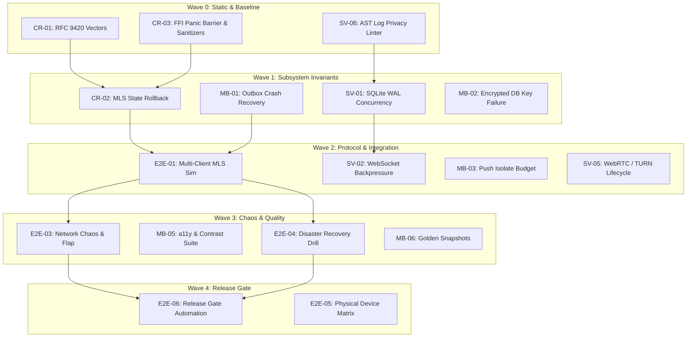

# Multiagent Testing Orchestration & Execution Plan

> **Superseded input:** Do not use this plan to claim or assign work. Follow
> `implementation/WORKFLOW.md` and the reviewed
> [QA task pack](../implementation/tasks/test-followups/README.md).

## 1. Overview & Architectural Principles

This document defines the complete operational orchestration plan to implement all remediation test suites identified in the testing gap audit.

The plan is designed strictly in compliance with Anthropic's four core engineering frameworks:
1. **[Model Selection](https://claude.com/blog/claude-models-explained-choosing-the-best-model-for-your-use-case)**: Allocate models by task reasoning difficulty rather than programming language.
2. **[Prompt Engineering Best Practices](https://platform.claude.com/docs/en/build-with-claude/prompt-engineering/claude-prompting-best-practices)**: Use XML-delimited prompt structures, role conditioning, strict negative constraints, and structured handoff schemas.
3. **[Multiagent Orchestration](https://platform.claude.com/docs/en/managed-agents/multiagent-orchestration)**: Organize agents into specialized domain roles with strict write-set isolation, coordinated by a central supervisor.
4. **[The Advisor Strategy](https://claude.com/blog/the-advisor-strategy)**: Pair high-capability Advisor models (Claude Opus) at critical security and protocol checkpoints with high-throughput Executor models (Claude Sonnet).

---

## 2. Multi-Agent Team Topology & Role Definitions

```
                         ┌─────────────────────────────┐
                         │      Coordinator Agent      │
                         │   (Orchestrator / Board)    │
                         └──────────────┬──────────────┘
                                        │
                         ┌──────────────┴──────────────┐
                         │        Advisor Agent        │
                         │ (Claude Opus - Reasoning)   │
                         └──────────────┬──────────────┘
                                        │ (Checkpoints & Risk Reviews)
        ┌───────────────────┬───────────┴───────────┬───────────────────┐
        ▼                   ▼                       ▼                   ▼
┌──────────────┐    ┌──────────────┐        ┌──────────────┐    ┌──────────────┐
│ Crypto Test  │    │ Server Test  │        │ Mobile Test  │    │  E2E / Infra │
│  Specialist  │    │  Specialist  │        │  Specialist  │    │  Specialist  │
│ (Rust / FFI) │    │ (Go / SQLite)│        │ (Dart / UI)  │    │ (Simulation) │
└───────┬──────┘    └───────┬──────┘        └───────┬──────┘    └───────┬──────┘
        └───────────────────┼───────────────────────┼───────────────────┘
                            ▼
                    ┌──────────────┐
                    │ Fast Triager │
                    │(Claude Haiku)│
                    └──────────────┘
```

### Agent Role Descriptions

1. **Coordinator Agent (Orchestrator)**:
   - Manages wave sequencing, task eligibility, and dependency resolution.
   - Enforces **zero write-set overlap** across concurrent agents.
   - Integrates PRs, executes full test passes (`scripts/test.sh`, `scripts/lint.sh`), and updates progress tracking.

2. **Advisor Agent (Claude Opus)**:
   - High-reasoning model consulted on complex, high-risk questions.
   - Mandatory reviewer for: MLS state transitions, FFI memory safety, SQLite WAL concurrency, cryptographic rollback protection, and disaster recovery.
   - Evaluates risks, edge-case counterexamples, and invariant violations without writing routine code.

3. **Domain Test Specialists (Claude Sonnet / Balanced+Advisor)**:
   - Dedicated executors owning specific test suites end-to-end.
   - Responsible for writing test code, running local test runners, reproducing edge cases, and verifying fixes.

4. **Fast Triage Agent (Claude Haiku / Fast)**:
   - Lightweight model for mechanical operations: parsing compiler error logs, formatting JSON test vectors, running static linters, and verifying license notices.

---

## 3. Phased Execution Waves & Dependency Graph



### Detailed Wave Milestones

| Wave | Milestone | Tasks | Output Artifacts | Primary Tier |
|---|---|---|---|---|
| **Wave 0** | Baseline & Safety | CR-01, SV-06, CR-03 | `rfc9420_vectors.rs`, `log_privacy_test.go`, FFI sanitizer configs | Strong / Balanced+Advisor |
| **Wave 1** | Subsystem Invariants | CR-02, SV-01, MB-01, MB-02 | `mls/state_test.rs`, `concurrency_test.go`, `outbox_recovery_test.dart` | Strong / Balanced+Advisor |
| **Wave 2** | Protocol & Integration | E2E-01, SV-02, MB-03, SV-05 | `multi_client_mls_test.go`, `backpressure_test.go`, `push_isolate_test.dart` | Strong / Balanced |
| **Wave 3** | Chaos & Quality | E2E-03, MB-05, E2E-04, MB-06 | `network_chaos_test.go`, `accessibility_test.dart`, `goldens/` | Balanced+Advisor / Balanced |
| **Wave 4** | Release Gate & Devices | E2E-06, E2E-05 | Automated `release-readiness.sh`, Hardware test matrix | Strong / Coordinator |

---

## 4. The Advisor Strategy Checkpoint Protocol

When an Executor hits a named checkpoint or encounters a disputed architectural decision:

### Advisor Query Contract (Executor -> Advisor)
```xml
<advisor_consultation>
  <task_id>GAP-CR-02</task_id>
  <subsystem>Rust Crypto State Rollback</subsystem>
  <invariant>MLS group epoch and local SQLite transaction must commit atomically or roll back completely.</invariant>
  <proposed_design>
    Introduce a two-phase staging buffer in Rust memory that only commits the ratchet tree update upon receipt of a confirmed disk sync callback from Dart FFI.
  </proposed_design>
  <disputed_points>
    1. Does the two-phase staging buffer introduce a memory leak if Dart FFI panics before confirming disk write?
    2. What occurs if a power cut happens between the Rust memory update and the SQLite WAL sync?
  </disputed_points>
  <relevant_files>
    - crypto/rust/src/mls/state.rs
    - mobile/lib/crypto/native_crypto_service.dart
  </relevant_files>
</advisor_consultation>
```

### Advisor Response Contract (Advisor -> Executor)
```xml
<advisor_advice>
  <verdict>APPROVED_WITH_MODIFICATIONS | REJECTED</verdict>
  <risk_analysis>
    Identifies edge cases, memory lifecycle hazards, and ciphersuite invariants.
  </risk_analysis>
  <counterexamples>
    Specific scenarios where the proposed design could fail closed or desync.
  </counterexamples>
  <mandatory_test_cases>
    Exact negative test cases the Executor must add to validate the fix.
  </mandatory_test_cases>
</advisor_advice>
```

---

## 5. Standardized Prompt Engineering Templates

### Template 1: Coordinator Task Dispatch Prompt
```xml
<role>You are the Coordinator Orchestrator for Veritra Testing.</role>
<context>
Read testing/README.md, testing/orchestration_plan.md, and docs/board.md.
</context>
<rules>
1. Never assign two tasks that modify overlapping file paths simultaneously.
2. Verify all prerequisite tasks in the preceding wave are 100% complete.
3. Validate all changes against repository privacy invariants.
</rules>
<action>Select next eligible task in Wave N, generate context packet, and dispatch to Domain Specialist.</action>
```

### Template 2: Domain Specialist Executor Prompt
```xml
<role>You are the Domain Test Specialist for {SUBSYSTEM}.</role>
<context>
Attached:
- Relevant gap specification: testing/{SUBSYSTEM}_testing_gaps.md
- Target source files: {FILE_PATHS}
- Repository invariants: AGENTS.md
</context>
<invariants>
- Ciphertext only on server storage and transport.
- Zero plaintext logging in slog calls.
- Fail closed under any cryptographic or parsing error.
</invariants>
<instructions>
1. Inspect target code paths and confirm existing test behavior.
2. Implement the missing test suite with comprehensive positive and negative assertions.
3. If this task requires an Advisor checkpoint, pause and submit the Advisor Query Contract.
4. Execute test runner ({TEST_COMMAND}) and confirm zero failures or regressions.
5. Format final output using the standard Handoff Schema.
</instructions>
```

### Template 3: Standard Executor Handoff Schema
```text
Task: [GAP-ID] - [Task Name]
Result: COMPLETE | BLOCKED | STALE
Target Files Modified: [List of file paths]
Tests Implemented: [List of test functions and descriptions]
Test Runner Command & Output: [Command executed and pass count]
Advisor Checkpoint: [Not Required | Advisor Query and Adopted Advice]
Invariants Verified:
  [x] Zero plaintext logging verified
  [x] Fail-closed error handling verified
  [x] Transactional consistency verified
Residual Risks / Blockers: [None or specific blocker]
```

---

## 6. Continuous Evaluation & Regression Verification Standards

Every completed test task must satisfy the following verification gate before being merged:

1. **Static Analysis & Lint**:
   - Go: `golangci-lint run` / `go vet ./...` (zero warnings).
   - Rust: `cargo clippy --all-targets -- -D warnings` (zero warnings).
   - Flutter: `flutter analyze` and `dart format --set-exit-if-changed` (clean).
2. **Deterministic Execution**: Tests must pass with zero flakiness across 10 repeated runs (`go test -count=10 ./...`, `cargo test -- --test-threads=4`).
3. **Zero Skipped Security Tests**: No `@Skip` annotations allowed on privacy, authentication, or cryptographic test cases.
4. **License & Dependency Integrity**: Any test utility dependencies must undergo license review and update `THIRD_PARTY_NOTICES.md`.
